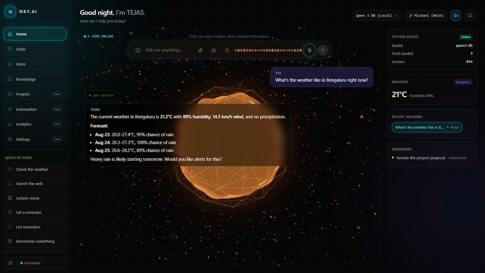
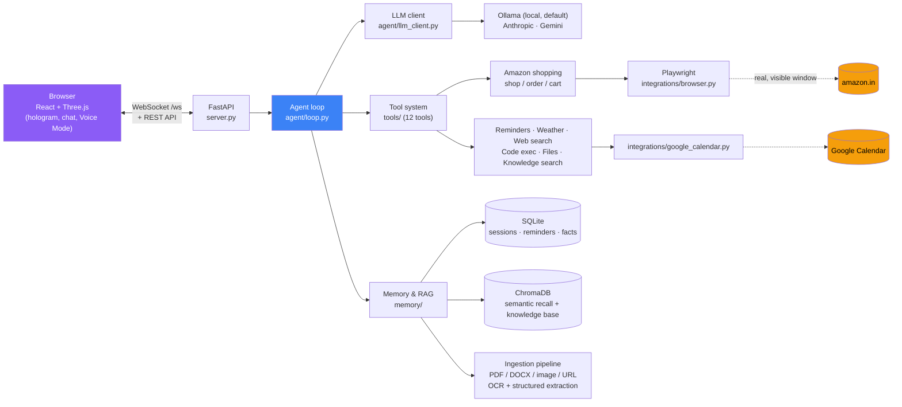

# TEJAS — Personal AI Assistant

[](https://github.com/NaveenKumarY-ENG/TEJAS-AI_Assistant/actions/workflows/ci.yml)
[](LICENSE)

*An Indian AI voice assistant, just like JARVIS.*

TEJAS is a full-stack personal AI assistant with a sci-fi, JARVIS-style holographic interface. It runs entirely on your own machine by default (local LLM via Ollama, local speech-to-text via Whisper, local SQLite/ChromaDB memory), with optional cloud backends (Anthropic Claude, OpenAI Whisper) you can switch on when you want stronger reasoning or accuracy.

It talks back and forth by text or voice, remembers context across sessions, and can actually *do* things — search the web, check the weather, run Python, manage files in a sandbox, track reminders, and search your own uploaded documents — via a small, pluggable tool system.



## Features

- **Real-time chat** over a WebSocket, with streaming responses. The composer is two stacked rows — the text box on top, growing upward on its own as a message gets longer, with the attach/camera/settings/mic/send toolbar as a separate row underneath instead of getting pushed down by it.
- **Voice input** — click the mic, speak, and it transcribes and sends automatically (local Whisper by default, no cloud dependency). Transcriptions are confidence-checked before being trusted (see [Notes on accuracy](#notes-on-accuracy)) — Whisper has no dedicated "silence" token, so quiet/near-silent audio can otherwise come back as a hallucinated word ("you", "Thank you.") that gets sent to the model as if it were real speech.
- **Voice output** — TEJAS speaks its replies aloud (toggle on/off in the top bar); works for both typed and spoken questions. A real neural voice (Kokoro-82M, GPU-accelerated via CUDA when available) runs server-side by default, falling back automatically to the browser's built-in voice if the neural backend isn't installed/available or a request fails. Switchable live between 3 voices (2 male, 1 female — see the voice selector next to the model switcher in the top bar and in Voice Mode) with no restart needed.
- **Fullscreen Voice Mode** (sidebar → Voice) — a dedicated, hands-free conversation view: it auto-listens again after each reply via real voice-activity detection, and can run a different model just for voice (e.g. a faster local one) than whatever Chat has active, swapping back automatically when you exit. Hands-free/mic controls live in the chat panel's own footer rather than floating over the hologram, which used to get clipped by it at some window sizes.
- **Tool use** — the model can call real tools (web search, weather, date/time, system info, sandboxed file I/O, sandboxed Python execution, reminders, fact memory, knowledge base search) instead of guessing.
- **Session history** — chats persist in SQLite; pick up an old conversation, start a new one, or delete one you no longer need, Claude-style.
- **Semantic memory** — relevant snippets from past conversations are recalled automatically via a ChromaDB vector store (with safeguards so stale, point-in-time facts like "today's weather" never get recalled as if still true). Recall is also distance-thresholded (`memory/vector.py`) — an unrelated question doesn't drag in the closest-available-but-irrelevant past exchange just because *something* has to be nearest; if nothing genuinely relevant exists, recall comes back empty instead.
- **Knowledge base** (sidebar → Knowledge) — upload `.txt`/`.md`/`.pdf`/`.docx`/`.png`/`.jpg`/`.jpeg` documents, paste a URL to ingest a web page directly (boilerplate — nav/header/footer — stripped before indexing), or jot a manual note with no file needed at all; TEJAS chunks, embeds, and can search all of it via the `search_knowledge` tool to answer questions from your own material. Images and scanned/image-only PDF pages are read via OCR (EasyOCR, GPU-accelerated on the same CUDA setup as voice output — `memory/ocr.py`), recognizing both English and Hindi text — many real-world documents worth OCR-ing here (Aadhaar cards especially) are bilingual, and an English-only reader doesn't skip the Hindi text, it tries to force those glyphs into English predictions and the resulting garbage bleeds into adjacent real fields too. Low-confidence detections (a misread watermark, a QR-code artifact) are dropped rather than included as if they were real text. Point it at a folder on this machine (Watched folders, in the panel) and it stays in sync automatically — new files ingested, changed files re-indexed, deleted files removed, live, no re-upload ever needed (`memory/folder_watch.py`). Replies grounded in the knowledge base show which document(s) they actually came from, right under the tool-call pill in the chat. Tag anything at creation time or retag it later (no re-upload/re-embedding needed) for lightweight organization, and use the in-app search box to browse the knowledge base's actual content directly, without going through chat. A deliberately separate ChromaDB collection from conversation memory above — an uploaded document is a trusted source, a recalled chat snippet isn't, and mixing the two risks a wrong recalled answer compounding itself as if it were verified fact (`memory/knowledge.py`). Search is also distance-thresholded, same as conversation memory above — a query with nothing genuinely relevant in the knowledge base returns no results rather than whatever chunk happens to be *closest*, which matters in particular for a low-quality chunk (e.g. noisy OCR text) that could otherwise look spuriously relevant to unrelated questions. Every ingested document also goes through structured field extraction (`memory/extraction.py`) — a local-only LLM call (always Ollama, regardless of which model is active for chat, so ID numbers and personal details never leave the machine) pulls out whatever fields are actually present as flat key-value pairs, plus a short document-type guess (e.g. "Aadhaar Card," "PAN Card," "Invoice"). Ask about a structured document and the reply comes back as a real Markdown table of its fields instead of a raw OCR text dump; the Knowledge panel shows the same fields inline (click the chevron on a document with a type badge) without needing to ask in chat at all. A plain prose document just gets `{"_document_type": "General Document"}` and behaves exactly as it always did — this is additive, not a replacement for chunk-based semantic search. A handful of well-known ID-document fields (Date of Birth, Aadhaar/PAN number, PIN code, mobile number) get an extra deterministic sanity check against their real expected shape before being trusted — confirmed live as a real, worthwhile check: a re-uploaded Aadhaar card once extracted "Date of Birth": "1947", a bare year with no day or month, because a stray "1947" happened to appear elsewhere in the scattered OCR text with nothing else nearby looking date-shaped. The extraction prompt already asks the model to omit values it can't confidently read, but that instruction isn't reliably followed by a small local model — same gap as the tool-calling and table-reproduction issues below — so a field failing its shape check is dropped instead of shown as fact.

Asking about one specific document by filename (e.g. "give me the details of report.pdf") scopes the search to that document alone via a ChromaDB metadata filter, rather than just exempting it from the relevance-distance threshold — confirmed live as a real bug otherwise: a document with little OCR-extractable text of its own could still return a *different*, merely-similar-looking document's data as the nearest embedding match, showing someone else's ID card fields as if they belonged to the file actually asked about.

Knowledge base search runs automatically on every turn (`agent/loop.py`), the same way conversation memory recall does — never dependent on the model deciding to call `search_knowledge` itself, which repeated live testing showed a small local model would unreliably skip for exactly the questions that matter most (a bare filename reference). A document's exact extracted field table is appended to the reply verbatim by the code, not retyped by the model — also confirmed live that a 7B model would "helpfully" alter an illegible OCR value into a cleaner-looking guess even when explicitly told to present it as-is, which is worse than showing the honest, imperfect original. "What's in my knowledge base" is answered directly too, from a lightweight ambient document listing, without needing a tool call. And a knowledge-grounded answer is never written to long-term memory (same principle as the point-in-time-fact exclusion above) — the documents it's grounded in can change (re-extraction, a retag, a deletion), and a memorized old answer has no way to know that happened. This covers "what's in my knowledge base" too, not just content questions — confirmed live as a real, separate gap: that question is answered from the ambient document listing rather than a `search_knowledge` match, so it fell through the content-only version of this guard, and a stale listing answer (naming documents since deleted) kept resurfacing until the guard was widened to catch it (`agent/loop.py`'s `_is_knowledge_listing_query`).
- **Real Calendar reminders** — "remind me to X on [date]" creates an actual Google Calendar event with a popup *and* email notification (`integrations/google_calendar.py`), not just an in-app list. Deliberately does not use its own scheduler/SMTP sender to fire these — Google's own infrastructure delivers both notification types, so a reminder still fires correctly even if this app's server isn't running at the time it's due. Falls back to an in-app-only reminder (today's original behavior) whenever Calendar isn't set up or a request fails — never blocks saving the reminder itself. One-time setup required — see [Setup](#setup). Reminders can also **recur** ("remind me every Monday to...") — the exact recurrence rule is always built by code from a simple `daily`/`weekly`/`monthly` choice, never hand-written by the model itself (weekly derives which day from the reminder's own date, so the model never has to name a weekday in any special syntax). **Reschedule or cancel** a reminder in plain conversation too ("push my QA report reminder to Friday," "delete the football reminder") — both keep the in-app copy and its Calendar event in sync. Every confirmation shows a readable date/time ("Wednesday, September 05, 2026 at 10:00 AM"), not raw ISO text, so a misheard date is obvious immediately rather than silently wrong.
- **Amazon shopping** — defaults to amazon.in (this app's actual target user; the underlying tools worked against amazon.com until this was corrected — the storefront a real user needs is the one that ships to and takes payment from where they actually are). Tier 1: "show me some phones on Amazon" opens a real, visible browser window (a dedicated Playwright-driven Chromium profile — never your everyday Chrome, no login needed for search) navigated to a live Amazon search, and returns up to 10 real results (title/price/rating/link) in chat (`tools/shopping_tool.py`). "Open Amazon"/"open amazon.in" with nothing specific in mind yet opens the plain homepage instead of searching for an empty term — a real gap confirmed live before this: an empty search used to come back with a misleading "couldn't read any listings ... Amazon may have changed its layout" as if something were broken, when the user just wanted to browse. A price constraint ("headphones under 1000," "between 500 and 1500") is applied as Amazon's own real price-range filter (the exact `rh=p_36:...` URL parameter, confirmed live directly from Amazon.in's own filter-sidebar links, not guessed) and then double-checked in code against every returned result — confirmed live as a real, worthwhile check: a free-text "under 1000" query alone (no real filter, just hoping Amazon's search box parses the phrase) returned real results up to ₹1,490, mostly sponsored listings ranked outside the stated budget. Title extraction survives a real Amazon layout quirk found live: search cards render TWO `<h2>` elements (a brand-only mini heading first, the actual full title second, marked with `aria-label`) — a plain first-match selector silently returned just the brand name ("OnePlus") for every result until this was caught and fixed.

  Tier 2: "order the [item]" (`tools/order_tool.py`) adds a specific item to your cart and walks to Amazon's real checkout summary page, then stops — it never clicks "Place your order" or selects a payment method, because neither capability exists in the code, not just something the model is told not to do. You can order three ways: from a prior `shop_amazon` result already in the conversation; by giving the product's full name/title with nothing else (e.g. reading it straight off a listing) — resolved via a real live search and matched against the closest title, not blindly the first result; or by sharing a real Amazon.in/amzn.in product link directly, even one that never came from a `shop_amazon` call in this conversation. A link that isn't genuinely Amazon is still refused outright, and even a link that passes that check is confirmed live — a real `#productTitle` must actually load — before anything else happens, so a hallucinated-but-plausible-looking link fails safely instead of silently proceeding. Every successful add states the product's real name, price, and link alongside the added-to-cart confirmation, not just a bare checkout summary. Adding to cart is confirmed by actually watching Amazon's own cart-count change, not just that the click didn't raise an error — a blocked click (a size/color prompt, a promo interstitial) used to be silently reported as success; a further live-found quirk (some listings render two elements sharing `id="add-to-cart-button"`, one permanently hidden) is also handled, clicking whichever one is actually visible. The final confirmation also flags it if the product's price has moved since the earlier search (Amazon prices shift constantly — flash deals, stock-based pricing) instead of letting a stale price go unmentioned right before a real cart decision. Amazon's real checkout funnel was confirmed live to be multi-step — a "Need anything else?" upsell page, then a "Secure checkout" summary with delivery address, order total, and payment method selection — and the tool stops at that summary rather than pushing further, since choosing a payment method is itself something this app must never do on your behalf. "What's in my cart" (`tools/cart_tool.py`, the `view_amazon_cart` tool) reads your real, live Amazon cart and lists every item's title/price/quantity/link — scoped to the actual active cart, not the separate "Saved for Later" list, which shares the same underlying markup but isn't really in your cart. Requires being logged into Amazon in that dedicated browser window once (session persists after that); if you're not, every one of these tools says so plainly rather than trying to sign in on your behalf. See [Security notes](#security-notes) for why full autonomous purchasing is a deliberate non-goal.
- **Switchable LLM backends** — local Ollama (Qwen 2.5, Llama 3.1, Gemma 2, ...), Anthropic Claude, or Google Gemini (hosted, stronger tool-calling; Gemini has a free tier with no billing/card required), swappable live from a dropdown in the top bar, no restart needed.
- **Dual STT backends** — local faster-whisper (free, offline) or OpenAI's Whisper API, with automatic fallback to local if the cloud call fails.
- **Quick actions** — one-click canned prompts (weather, web search, system check, reminders, memory, timezone lookups, quick calculations) in the sidebar for instant access without typing.
- **Creator profile popup** — clicking the "N" avatar in the sidebar shows the creator's name and contact links (`frontend/src/constants/profile.ts`).
- **A hand-built Three.js hologram** — the "AI Core" visual reacts to the assistant's state (idle / listening / thinking / speaking) and, while actually listening, to your real live microphone volume: three tumbling, segmented "broken ring" reticles (`OrbitalRings.tsx`) each carry bright energy comets that sweep faster and brighter as you speak louder, not just on a discrete before/after state change. The TEJAS emblem is composited into the sphere's center as a pure CSS/DOM overlay rather than a Three.js texture, so it never touches the particle field/ring shaders underneath, and is sized off container *height*, not width — the sphere's own rendered size tracks canvas height at a fixed camera distance/FOV — so it stays correctly proportioned whether it's rendering in the Home screen's confined panel or Voice Mode's fullscreen overlay, which have very different aspect ratios. Both views share a purple-into-black radial gradient behind the hologram (`utils/hologramBackdrop.ts`) instead of a flat void, and the browser tab's favicon is the same TEJAS emblem rather than a generic placeholder icon.
- **Formatted replies** — assistant messages render real Markdown (bold, lists, links, inline code) instead of showing raw `**asterisks**`; links are scheme-checked before becoming clickable (see [Security notes](#security-notes)).

## Architecture



- **Backend**: Python, FastAPI, a single WebSocket endpoint that streams the conversation turn by turn. The agent loop calls the LLM, executes any tool calls it requests, feeds results back, and repeats until it produces a final answer.
- **Frontend**: React 19 + TypeScript + Vite, with a Three.js/`@react-three/fiber` hologram rendered full-bleed behind a floating chat UI, styled with Tailwind CSS v4 and state managed by Zustand.
- **Persistence**: SQLite for chat sessions/messages/reminders/facts (`memory/structured.py`), ChromaDB for semantic recall (`memory/vector.py`) and the knowledge base (`memory/knowledge.py`) — two separate collections, since an uploaded document is a trusted source and a recalled chat snippet isn't (see [Features](#features)).
- **Integrations**: `integrations/browser.py` drives a real, visible Chromium window (Playwright) against amazon.in for the shopping tools; `integrations/google_calendar.py` syncs reminders to a real Google Calendar via OAuth. Both are lazily initialized — nothing launches until the first tool call that actually needs it.

> **Known limitation**: model/voice selection (`config.py`) is a single process-wide setting, not scoped per browser tab or session — switching the active model in one open tab changes it for every other tab/session talking to the same running server. Fine for the single-user, single-active-session use this app is built for; worth knowing if you ever have multiple tabs open at once.

> The sidebar's Weather widget is **not** wired to the `get_weather` tool — it's an independent client-side fetch straight from Open-Meteo (`WeatherWidget.tsx`), separate from the backend's `tools/weather.py` that the AI calls when you *ask* about weather in chat. Both happen to hit the same free API, but changing one does not affect the other.

## Project structure

```
tejas-assistant/
├── server.py                # FastAPI app: WebSocket endpoint + REST endpoints
├── main.py                  # CLI entry point — text-only terminal chat, no web UI
├── config.py                # All settings, loaded from .env
├── agent/
│   ├── loop.py               # Core agent loop: history, tool-calling, streaming, memory
│   ├── llm_client.py         # Ollama + Anthropic backends behind one interface
│   ├── transcription.py      # Local (faster-whisper) + OpenAI speech-to-text
│   └── tts.py                 # Neural voice output (Kokoro-82M, GPU via CUDA)
├── tools/                   # One file per tool; register new ones in tools/__init__.py
│   ├── web_search.py         # Tavily-backed web search
│   ├── weather.py            # Open-Meteo current weather + forecast
│   ├── datetime_tool.py      # Other-timezone date/time lookups
│   ├── system_info.py        # Read-only host OS/CPU/disk info
│   ├── file_ops.py           # Sandboxed read/write/list files
│   ├── code_exec.py          # Sandboxed Python execution
│   ├── memory_tool.py        # Reminders (+ real Calendar events) + user-fact memory
│   ├── knowledge_tool.py     # Search uploaded knowledge-base documents
│   ├── shopping_tool.py      # Amazon product search via a real browser (Tier 1 — no purchasing)
│   ├── order_tool.py         # Amazon cart + checkout review via a real browser (Tier 2 — stops before payment)
│   └── cart_tool.py          # Reads the real, live Amazon cart — read-only
├── memory/
│   ├── structured.py         # SQLite: sessions, messages, reminders, facts, documents, watched folders
│   ├── vector.py             # ChromaDB: semantic recall of past conversations
│   ├── knowledge.py          # ChromaDB: uploaded document chunks (separate collection)
│   ├── ocr.py                 # EasyOCR: image/scanned-PDF text extraction for the knowledge base
│   ├── folder_watch.py       # watchdog: keeps a watched folder's documents in sync live
│   └── extraction.py         # Local-only LLM call: structured field extraction (ID cards, invoices, ...)
├── integrations/             # Third-party service wrappers (not this app's own data/tool interface)
│   ├── google_calendar.py    # Real Calendar events for reminders (popup + email, Google-delivered)
│   └── browser.py            # Persistent Playwright/Chromium context for the Amazon shopping tool
├── frontend/                 # React/Three.js dashboard (Vite)
│   └── src/
│       ├── components/       # core/ (hologram), ui/ (chat, widgets), layout/, voice/, knowledge/
│       ├── hooks/             # WebSocket, speech recognition/synthesis, toast
│       └── store/             # Zustand app state
├── tests/                    # pytest suite (agent loop, tools, LLM client translation, knowledge base, OCR, structured extraction, transcription, folder watch, vector memory, server)
├── data/                     # SQLite DB, vector store, sandbox dir (created at runtime)
└── .env.example              # Copy to .env and fill in
```

## Prerequisites

- Python 3.11+
- Node.js 18+ (for the frontend)
- [Ollama](https://ollama.com) installed and running locally — this is the default LLM backend. `qwen2.5:7b` is the one active at startup (`OLLAMA_MODEL` in `.env`), but pulling all four lets you use the in-app model switcher (top bar) to swap between them live:
  ```
  ollama pull qwen2.5:7b
  ollama pull qwen3:8b
  ollama pull llama3.1
  ollama pull gemma2:9b
  ```
  `qwen3:8b` is a newer generation than `qwen2.5:7b` at a similar size/speed footprint — a meaningfully better option to add if you have the ~5GB of disk to spare.

## Setup

**1. Backend**

```bash
python -m venv .venv
.venv\Scripts\activate          # Windows
# source .venv/bin/activate     # macOS/Linux

pip install -r requirements.txt

# Optional but recommended if you have an NVIDIA GPU: install a CUDA build of
# torch AFTER the line above, not before — kokoro (voice output) and easyocr
# (Knowledge base OCR) both depend on torch, and installing/upgrading either
# one can silently replace an already-installed CUDA torch with PyPI's
# default CPU-only wheel to satisfy its own version resolution. Running this
# last guarantees the CUDA build wins and nothing after it can clobber it.
# Skipping this step entirely is also fine — everything still works on CPU,
# just slower for TTS/OCR. Pick the cu1xx tag matching your installed CUDA
# toolkit (cu121/cu124/...); if unsure, this works for most recent drivers:
pip install "torch==2.5.1+cu121" "torchvision==0.20.1+cu121" --index-url https://download.pytorch.org/whl/cu121

copy .env.example .env          # Windows: copy, macOS/Linux: cp
```

Edit `.env` as needed (see [Configuration](#configuration) below) — the defaults work out of the box with just Ollama running locally.

Neural TTS also uses `espeak-ng` as an optional fallback for out-of-dictionary/foreign words (not needed for normal English text) — install it separately if you notice mispronounced uncommon words: [espeak-ng releases](https://github.com/espeak-ng/espeak-ng/releases).

**Optional — real Calendar reminders.** Without this, `manage_reminders` still works exactly as before (in-app only). To enable it:
1. Go to [Google Cloud Console](https://console.cloud.google.com/), create a project (any name).
2. In "APIs & Services" → "Library", enable the **Google Calendar API**.
3. In "APIs & Services" → "OAuth consent screen", configure it (External is fine; Testing mode is fine for personal use — add your own Google account under "Test users").
4. In "APIs & Services" → "Credentials", create an **OAuth client ID** of type **Desktop app**, and download the JSON.
5. Save that file as `data/google_credentials.json`.
6. Run `python -m integrations.google_calendar` once — it opens a browser for a single consent click, then writes `data/google_token.json` (a refresh token; it renews itself silently after this, no further prompts). Both files stay local, are gitignored via `data/`, and are never sent anywhere except Google's own API.

**Optional — the Amazon shopping tool.** Without this, `shop_amazon` reports itself unavailable with a setup message. `pip install -r requirements.txt` installs the `playwright` package, but not a browser — that's a separate one-time download:
```bash
playwright install chromium
```

**2. Frontend**

`frontend/dist` (the built UI) is committed to the repo, so **you can skip this step entirely** if you just want to run the app — `uvicorn server:app --reload` alone is enough, no Node/npm required at all. Only do this if you plan to modify the frontend:

```bash
cd frontend
npm install
```

### Docker (alternative to the above)

```bash
docker compose up --build
# once it's up, pull a model into it (first time only):
docker compose exec ollama ollama pull qwen2.5:7b
```

Then open http://localhost:8000. This brings up Ollama and the backend together, with reminders/Calendar sync, voice, and the knowledge base all working normally. Not included: GPU acceleration for TTS/OCR (runs on CPU instead — functional, just slower) and the Amazon shopping tools, which open a real, visible browser window that doesn't fit a headless container — see `Dockerfile`'s header comment for the full reasoning. Everything else works the same as the manual setup below.

## Running

You need both processes running at once, in separate terminals (skip this section entirely if you used Docker above):

**Backend** (from the project root):
```bash
uvicorn server:app --reload
```
Once it's up, this opens `http://127.0.0.1:8000` in Chrome automatically (only once per `--reload` session, not on every autoreload restart). Set `TEJAS_NO_AUTO_OPEN=1` in `.env` to disable — e.g. on a headless machine.

**Frontend** (from `frontend/`, dev mode with hot reload):
```bash
npm run dev
```

Then open the URL Vite prints (typically `http://localhost:5173`). The Vite dev server proxies `/api` and `/ws` to the FastAPI backend on port 8000.

**Production build** — `frontend/dist` (what `server.py` serves directly at `http://127.0.0.1:8000`, no separate frontend server needed) is committed to the repo and kept up to date with source. You only need to rebuild it yourself (`npm run build` inside `frontend/`) if you've changed frontend source and want to see those changes reflected — a plain `git clone` already has a working, current build without that step. If `frontend/dist` is ever somehow missing entirely, the server returns a clear "run `npm run build`" message rather than any UI at all — there is no silent fallback UI. (An older, much plainer HTML/CSS/JS prototype used to live in `static/` and get served silently whenever the build was missing, which is why the UI could look completely different across machines — that prototype has been removed for exactly this reason.)

> **Contributing frontend changes?** `frontend/dist` is committed, so it must be rebuilt and included in the same commit as any change under `frontend/src/` — otherwise the tracked build drifts out of sync with the source next to it, and anyone who pulls (without separately running `npm run build`) keeps seeing the old UI. Run `npm run build` and `git add frontend/dist` alongside your source changes before committing.

> **Machine still shows an old name/branding, or is missing a feature you know you pushed?** Before this project committed `frontend/dist`, every checkout had to build its own copy locally, and pulling new source never touched that local build — so a machine's UI could silently drift out of sync with its own code with no error. If you're seeing that now on an *existing* checkout that predates this change, delete its stale `frontend/dist/` folder once, then `git pull` — the committed build will take its place cleanly. `.env` and `data/` (your local session history/DB) are separately per-machine and never touched by git either way — pulling code doesn't change your API keys or chat history on that machine.

**CLI mode** — `main.py` is a separate, text-only terminal interface that talks to the same `Agent` class directly (no server, no browser, no voice):
```bash
python main.py            # new session
python main.py --resume   # continue the most recent session
python main.py --debug    # also print logs to stdout (always logged to assistant.log)
```

## Configuration

All settings live in `.env` (copy from `.env.example`). Key ones:

| Variable | Default | Purpose |
|---|---|---|
| `LLM_PROVIDER` | `ollama` | `ollama` (local, free), `anthropic` (hosted, better tool-calling), or `gemini` (hosted, free tier available) |
| `OLLAMA_MODEL` | `qwen2.5:7b` | Local model name (must be pulled already) |
| `OLLAMA_KEEP_ALIVE` | `30m` | How long Ollama keeps the model loaded after last use. Higher avoids reload cost between messages; see [Performance notes](#performance-notes) |
| `ANTHROPIC_API_KEY` | — | Required only if `LLM_PROVIDER=anthropic` |
| `ASSISTANT_MODEL` | `claude-sonnet-4-6` | Anthropic model name |
| `GEMINI_API_KEY` | — | Required only if `LLM_PROVIDER=gemini`. Free, no billing needed: [aistudio.google.com/apikey](https://aistudio.google.com/apikey) |
| `GEMINI_MODEL` | `gemini-3.6-flash` | Gemini model name. `gemini-2.5-flash` has been retired for new API keys (Google's own 404 points to `gemini-3.6-flash` as the replacement). Confirmed live: `gemini-3.7-flash`'s free tier caps out at just 20 requests/day (`RESOURCE_EXHAUSTED`) — heavy testing exhausted the daily quota on `gemini-3.6-flash` too, so treat any Gemini free-tier quota as tight for now, not just the newest model |
| `LLM_TEMPERATURE` | `0.0` | Sampling temperature. Kept at 0 for factual reliability — small local models drift from facts given in the prompt at higher temperatures |
| `ASSISTANT_NAME` | `TEJAS` | Display name used in the UI and system prompt |
| `STT_PROVIDER` | `local` | `local` (faster-whisper, offline) or `openai` (Whisper API; auto-falls-back to local on failure) |
| `WHISPER_MODEL` | `small.en` | Local Whisper model size (`tiny.en` → `medium.en`, bigger = more accurate but slower) |
| `OPENAI_API_KEY` | — | Required only if `STT_PROVIDER=openai` |
| `TTS_PROVIDER` | `neural` | `neural` (Kokoro-82M, GPU via CUDA when available) or `browser` (disable server-side TTS, use the browser's built-in voice only). `neural` also auto-falls-back to the browser voice at runtime if torch/kokoro aren't installed |
| `TTS_VOICE` | `am_michael` | Startup voice — switchable live in the UI between the 3 presets in `AVAILABLE_TTS_VOICES` (`config.py`): `am_michael`/`am_fenrir` (male), `af_heart` (female). Any other name from the [voice pack list](https://huggingface.co/hexgrad/Kokoro-82M) also works here, just won't appear as a clickable option |
| `TTS_LANG_CODE` | `a` | Kokoro language/voice-pack prefix (`a` = American English); must match `TTS_VOICE`'s prefix |
| `SEARCH_API_KEY` | — | Optional. Enables `web_search` (free key at [tavily.com](https://tavily.com)) |
| `TEJAS_NO_AUTO_OPEN` | — | Set to `1` to stop `uvicorn server:app --reload` from auto-opening Chrome on startup (e.g. headless/CI environments) |

## Available tools

The model decides when to call these — it doesn't guess at things it can look up. Kept deliberately low (12, not more): on CPU-only local inference, every tool in the schema adds real, measured latency to *every* request (see [Performance notes](#performance-notes) below), so related actions are grouped into one tool with an operation/action parameter rather than split into many single-purpose ones. `search_knowledge`, `shop_amazon`, `order_amazon`, and `view_amazon_cart` are exceptions worth their slot — none of those capabilities exist at all without their own tool.

| Tool | What it does |
|---|---|
| `web_search` | Search the web (Tavily) for current info not in the model's training data |
| `get_weather` | Current weather + 3-day forecast for a city (Open-Meteo, no key needed) |
| `get_current_datetime` | Date/time in a specific *other* timezone (the local system time is already given to the model directly, so this only covers timezone lookups) |
| `get_system_info` | Read-only OS/CPU/disk info about the host machine |
| `file_ops` | Read, write, or list files in a sandbox directory (`data/sandbox/`) — set `operation` to `read`/`write`/`list`. Can't touch the rest of your filesystem |
| `execute_python` | Runs a Python snippet in an isolated subprocess with a timeout |
| `manage_reminders` | Add, list, complete, update, or delete reminders — set `action` accordingly. Adding one with a due date also creates a real Google Calendar event (popup + email reminder, optionally recurring) when [Calendar is set up](#setup); otherwise it's saved in-app only. `update`/`delete` keep the linked Calendar event in sync |
| `remember_fact` | Save a fact/preference about you for future recall |
| `search_knowledge` | Search documents you've uploaded to the knowledge base (sidebar → Knowledge) |
| `shop_amazon` | Search Amazon.in for a product (or open it with no query for "open Amazon") — opens a real, visible browser window and returns up to 10 real results (title/price/rating/link), optionally constrained by a real min/max price filter. Search only; never adds to cart or purchases anything |
| `order_amazon` | Add a product to cart and reach Amazon's checkout summary — from a prior `shop_amazon` result, a product name/description (resolved via a live search), or a shared Amazon.in/amzn.in link. Never completes the purchase or selects a payment method — stops at the summary and asks you to finish yourself. Requires being logged into Amazon in the shopping browser window |
| `view_amazon_cart` | Read what's actually in your real, live Amazon cart right now — title/price/quantity/link per item. Read-only; never adds, removes, or changes anything |

To add a new tool: create a file in `tools/`, subclass `Tool` (see `tools/base.py`), and add one line to `tools/__init__.py`.

## API reference

The frontend talks to `server.py` over one WebSocket plus a handful of REST endpoints — useful if you're scripting against it directly or building a different frontend:

| Endpoint | Purpose |
|---|---|
| `WS /ws` | The chat itself. Send `{"text": "..."}`; receive a stream of `{"type": "chunk\|tool\|tool_result\|done\|error", ...}` events. `tool_result` (`{name, result}`) is only ever sent for `search_knowledge` — it's what powers the citation caption under that tool's pill in the chat UI. Optional `?session_id=<id>` or `?resume=1` query params pick which session to attach to. |
| `GET /api/meta` | Assistant name, active model, full tool list (name + description), whether neural TTS is available (`tts_available`), and whether OCR is available (`ocr_available`) — what the UI header/status panel reads on load, and what decides which voice engine the frontend uses. |
| `GET /api/models` | All models in `AVAILABLE_MODELS` plus which one is currently active. |
| `POST /api/models` | Switch the active model. Body: `{"id": "<model id from /api/models>"}`. Takes effect on the next chat turn. |
| `GET /api/sessions` | Recent sessions with message counts, newest first. |
| `DELETE /api/sessions/{id}` | Delete a session and its messages. 404 if it doesn't exist. |
| `GET /api/reminders` | Active (not-yet-completed) reminders. |
| `GET /api/knowledge` | List uploaded knowledge-base documents (id, filename, chunk count, tags, source type, upload date). A URL-ingested entry's "filename" is the URL itself; a note's is its title. |
| `POST /api/knowledge` | Multipart file upload (`file` field, `.txt`/`.md`/`.pdf`/`.docx`/`.png`/`.jpg`/`.jpeg`, optional `tags` field — comma-separated) → chunked, embedded, and indexed. Images and scanned/image-only PDF pages are OCR'd (`memory/ocr.py`) when OCR is available. Returns the new document's metadata. 400 for an unsupported type, no extractable text, or OCR being unavailable for an image. |
| `POST /api/knowledge/url` | Body `{"url": "...", "tags": [...]}` → fetches the page, strips boilerplate (nav/header/footer/script/style), chunks and indexes the remaining text. 400 if the URL can't be fetched or has no extractable text. |
| `POST /api/knowledge/note` | Body `{"title": "...", "text": "...", "tags": [...]}` → chunks and indexes a manually-written note, no file involved. 400 for an empty title or body. |
| `PATCH /api/knowledge/{id}/tags` | Body `{"tags": [...]}` → replaces a document's tags in place. 404 if it doesn't exist. |
| `GET /api/knowledge/search?q=...` | The same semantic search `search_knowledge` (the tool) uses, exposed directly — powers the Knowledge panel's in-app search box. Returns `{"results": [{filename, text}, ...]}`. |
| `DELETE /api/knowledge/{id}` | Delete a document and all its chunks. 404 if it doesn't exist. 400 if it's managed by a watched folder — unwatch the folder or remove the file instead. |
| `GET /api/knowledge/folders` | List watched folders (id, path, live file count). |
| `POST /api/knowledge/folders` | Body `{"path": "..."}` → start watching a folder on this machine (`memory/folder_watch.py`); an initial scan ingests what's already there, then new/changed/deleted files stay in sync live. 400 if the path isn't a real folder or is already watched. |
| `DELETE /api/knowledge/folders/{id}` | Stop watching a folder and delete every document it produced. 404 if it doesn't exist. |
| `POST /api/transcribe` | Multipart audio upload (`audio` field) → `{"text": "..."}`. Powers the mic button; also usable standalone. |
| `POST /api/tts` | Body `{"text": "..."}` → `audio/wav` bytes, synthesized by the neural voice (`agent/tts.py`). Only meaningful when `tts_available` is true; the frontend falls back to the browser voice otherwise. |
| `GET /api/tts/voices` | All voices in `AVAILABLE_TTS_VOICES` plus which one is currently active. |
| `POST /api/tts/voices` | Switch the active TTS voice. Body: `{"id": "<voice id from /api/tts/voices>"}`. Takes effect on the next spoken reply — no reload (Kokoro's voice is a per-call parameter). |

## Testing

```bash
python -m pytest tests/ -q
```

`tests/conftest.py` points the whole run at an isolated, throwaway data directory (`TEJAS_DATA_DIR`, cleaned up automatically after the session) instead of your real database — a knowledge-base test asserting "an unrelated query returns no results" was flaky twice before this existed, once against garbled OCR text and once against a real uploaded PDF, simply because it was checking against whatever real documents happened to be in the live knowledge base at the time.

Frontend build/lint/test:
```bash
cd frontend
npm run build
npm run lint
npm run test
```

Frontend tests (Vitest — `frontend/src/**/*.test.ts`) cover the state layer driving the app's critical paths: sending a message and streaming a reply, tool-call UI state, session switching, and the text-processing helpers behind voice output (Markdown stripping, sentence-boundary splitting for streamed speech). Deliberately scoped to pure store/utility logic rather than full component rendering — the Three.js hologram isn't meaningfully testable in a headless environment, and this is where the actual application logic actually lives.

Both this and the backend test suite run automatically on every push via GitHub Actions (see the badge at the top of this file / `.github/workflows/ci.yml`).

## Notes on accuracy

Local 7B-class models are noticeably less reliable than hosted models like Claude at tool-calling and staying grounded in given context. Two things in this codebase specifically compensate for that:

- The current date/time is injected directly into the system prompt every request (not left to the model to "know" or fetch), and sampling temperature is kept at 0 so the model doesn't drift off given facts.
- Point-in-time facts (weather, date/time, system stats) are excluded from long-term semantic memory, so a stale reading never gets recalled later and repeated as if still current.
- The system prompt explicitly forbids following a disclosed tool failure with a guessed answer ("however, based on what I know...") — a smaller local model will otherwise disclose the failure *and then guess anyway*, which is worse than either alone. `tools/web_search.py` also treats a leftover placeholder `SEARCH_API_KEY` (copied from `.env.example` and never filled in) the same as a missing one, returning a clear "not configured" message instead of a confusing raw HTTP error that a model can use as cover to fabricate an answer.
- Local Whisper transcription (`agent/transcription.py`) checks each segment's own confidence (`no_speech_prob`, `avg_logprob`) before trusting it, on both the normal VAD-filtered pass and the no-VAD retry that follows an empty result. Whisper has no dedicated "silence" token — trained on huge amounts of scraped video with silent/near-silent stretches, it resolves those into short filler phrases ("you", "Thank you.") instead of an empty transcription, and the no-VAD retry pass is exactly the scenario that triggers it. Confirmed live and reproduced directly against the model: 2 seconds of quiet noise (no real speech) transcribed as "Thank you." with `no_speech_prob=0.91`. A segment failing the check is dropped; if nothing is left, the turn is correctly treated as "didn't catch that" instead of handing the chat model a hallucinated sentence to improvise a reply to.
- Structured document-field extraction has the same class of protection — see the knowledge base entry in [Features](#features) above.

If you need stronger overall reasoning and tool reliability, switch `LLM_PROVIDER=anthropic` (costs money) or `LLM_PROVIDER=gemini` (free tier, no billing required) in `.env` — no local install needed either way.

### Switching models at runtime

`OLLAMA_MODEL`/`LLM_PROVIDER` in `.env` only set the model active at startup. From there, the model switcher in the top bar of the UI lets you swap between the presets in `AVAILABLE_MODELS` (`config.py`) — currently `qwen2.5:7b`, `qwen3:8b`, `llama3.1:latest`, `gemma2:9b`, Claude, and Gemini — on the fly, no restart or reconnect needed (`GET`/`POST /api/models`). Local models must already be pulled (e.g. `ollama pull llama3.1`); switching to the Anthropic or Gemini entry requires the matching API key to be set.

Not every local model supports Ollama's tool-calling template — `gemma2:9b` doesn't, and would error on every turn if tools were sent to it. Models like this are flagged `"supports_tools": False` in `AVAILABLE_MODELS`, which makes the backend omit the tools payload and adjust the system prompt accordingly: the model still chats normally, it just can't call `web_search`, `execute_python`, reminders, etc. while active. `qwen2.5:7b` and `llama3.1:latest` both support tools fully.

## Performance notes

On CPU-only hardware (no CUDA/ROCm GPU — the common case on a laptop), local models are slow for a specific, measured reason: **the tool schema sent on every request is the dominant cost, not model size or generation length.** Measured on an i5-1135G7 laptop (4 cores, integrated graphics only) with `qwen2.5:7b`:

| Call | Time |
|---|---|
| Cold model load + simple question, no tools | ~14s |
| Same question, warm, no tools | ~2s |
| Question, warm, **with** the full tool schema attached | ~42–57s |

That last number looks like it should be a fixed cost paid on every single request — but it isn't. **Ollama caches the KV state for a matching prompt prefix across separate calls**: a byte-identical repeat of the same tool-laden call dropped from 38s to ~4.5s on the 2nd/3rd try, and — more usefully — even a call with the *same system prompt + tools but a different trailing question* still dropped to ~12–15s, because the expensive, mostly-static part (system prompt + ~800 tokens of tool schema) got reused instead of reprocessed.

This app used to defeat that caching on every request without realizing it: the live clock was embedded directly inside the system prompt (`Current date and time: ...`), which changes every call by definition — meaning the "prefix" was never actually identical twice, so Ollama had nothing to reuse. Fixed by splitting it: `config.static_system_prompt()` (tool rules, model capabilities — never changes for a given model) is now the system message on every call, and `config.current_time_context()` (the live clock) is injected per-turn into the outgoing user message instead (`agent/loop.py`'s `_messages_for_llm`, the same non-persisted-enrichment pattern already used for recalled memory context) — so it grounds the model correctly without touching the cacheable prefix.

End-to-end impact, measured through the real app (not a synthetic benchmark) over a 4-turn conversation: response time went **131s → 47s → 31s → 30s** and leveled off there, instead of staying flat around 45–57s on every single turn as it did before. `vector.recall()`'s semantic-memory lookup and the real (longer, multi-paragraph) system prompt mean the real app doesn't hit the ~12–15s floor a stripped-down isolated test did, but the trend — declining then stabilizing, rather than flat — is the real win.

Two other things in this codebase help further:
- **`OLLAMA_KEEP_ALIVE`** (`.env`, default `30m`) keeps the model loaded in memory between messages so you don't pay the ~10s reload cost on every turn — Ollama's own default is only 5 minutes.
- **Tool count is kept deliberately low** (11, see [Available tools](#available-tools)) instead of one tool per action — `file_ops` and `manage_reminders` each replace what used to be 3 separate tools, cutting the schema payload ~20% and shaving a proportional amount off the one-time cost of populating the cache. Real trade-off: a multi-purpose tool with an `operation`/`action` parameter is marginally harder for a small local model to call correctly than several clearly-named single-purpose tools — verified live against `qwen2.5:7b` before landing (all 4 operations across both consolidated tools called correctly).

None of this changes the fundamental limit: the *first* processing of ~800 tokens of tool schema on a CPU-only 7B model will always take tens of seconds. If that's not acceptable, `LLM_PROVIDER=anthropic` or `LLM_PROVIDER=gemini` (the latter free, no billing required) don't hit this wall at all — cloud inference processes the same schema in a couple of seconds, every time.

### GPU/VRAM sharing (Ollama + neural TTS)

On a GPU-enabled machine, Ollama and Kokoro (neural TTS) share the same VRAM pool. A 7B-class Ollama model typically holds ~4GB; Kokoro-82M is small enough (well under 500MB) that it comfortably coexists on an 8GB card, and still fits on a 6GB card with a few GB to spare. If you're on a smaller GPU and see out-of-memory errors, set `TTS_PROVIDER=browser` to free that headroom for the LLM — voice output still works, just via the browser's voice instead of the neural one.

## Security notes

- Never commit your real `.env` — only `.env.example` (with placeholder values) belongs in version control.
- `execute_python` and `file_ops` are sandboxed to `data/sandbox/` — they cannot access the rest of your filesystem.
- `execute_python` runs with a hard timeout and no special privileges beyond the sandbox directory.
- Assistant replies render as Markdown (see [Features](#features)), which means links in them can become real clickable `<a>` elements — including links the model might reproduce verbatim from `web_search` results on an untrusted page. `ConversationPanel.tsx` only renders `http:`/`https:`/`mailto:` links as clickable; anything else (`javascript:`, `data:`, ...) renders as inert plain text instead.
- `shop_amazon` is search-only (Tier 1) — it never adds to cart, logs in, or attempts checkout. `view_amazon_cart` is also read-only — it never adds, removes, or changes anything in the cart. `order_amazon` (Tier 2) advances one step further — adds to cart and reaches Amazon's checkout summary — but **completing a purchase is a deliberate non-goal, enforced structurally, not just prompted against**: `tools/order_tool.py` simply contains no code path that clicks a final "Place your order" button or selects a payment method, so no instruction (from the user, or a prompt-injection attempt via an untrusted page) can make it complete a real purchase — the capability doesn't exist to be misused. This isn't just caution for its own sake: Amazon's Terms of Service explicitly prohibit automated purchasing (and its bot detection can flag/suspend the account it runs against), and finishing a real payment with no human confirmation is squarely the kind of irreversible action this app's own system prompt already requires confirming first (reinforced by an explicit rule there too — see `config.py`). A fully autonomous Tier 3 is technically buildable on the same foundation, but would need to be a separate, explicitly opt-in mode with hard guardrails (a spending cap, a second confirmation channel) — never the default.
- `order_amazon` never automates logging into Amazon — it only checks whether the dedicated shopping browser window (a profile under `data/browser_profile/`, separate from your everyday Chrome) is already signed in, and tells you plainly to sign in yourself if not. No Amazon credentials are ever entered, stored, or seen by this app's code.
- `integrations/google_calendar.py`'s OAuth token (`data/google_token.json`) and client secret (`data/google_credentials.json`) are local files under the already-gitignored `data/` directory — never committed, and used only to call Google's own Calendar API directly (nothing routes through a third party).
